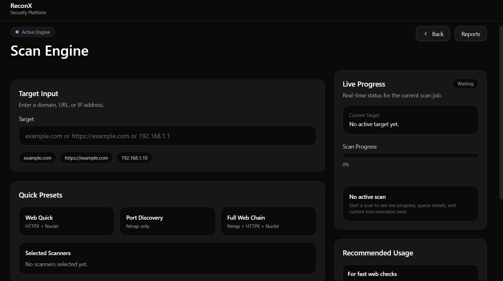

# ReconX 🚀 

🔒 This is a **showcase version** of ReconX.  
Core logic and proprietary components are kept private.

---

## 🔥 Overview
ReconX is an automated reconnaissance and security analysis platform designed to streamline bug bounty and penetration testing workflows.

It integrates multiple tools into a centralized dashboard for efficient scanning, monitoring, and vulnerability analysis.

---

## ⚙️ Key Features
- Automated reconnaissance workflow
- Centralized dashboard for scan results
- Authentication system (Google OAuth)
- Asynchronous task processing (Celery + Redis)
- Usage tracking & monitoring
- Admin panel with audit logs

---

## 🧱 Tech Stack
- Python / Django
- Celery & Redis
- PostgreSQL
- AWS EC2
- Nginx & Gunicorn
- HTML / CSS / JavaScript

---

## 📸 Screenshots

### 🔹 Dashboard

### 🔹 Scan Results

---

## 🏗️ Architecture (High-Level)
User → Web App → Task Queue → Workers → Recon Tools → Results Dashboard

---

## 🔗 Note
This repository is intended for demonstration purposes only.  
Full implementation and source code are private.

---

## 📌 Status
🚧 Actively under development
